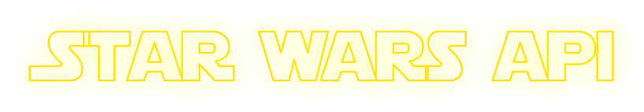

  

# Star Wars API

API Star wars, created for the study of consumption of APIS.

the results can be find hosted [Here: (https://angry-goodall-1b4c9d.netlify.app/)](https://angry-goodall-1b4c9d.netlify.app/)

This project make use of: 

- React
- React-router-dom
- Material-UI
- Styled-components
- Netlify host

No patterns were used at the beginning but some will be inserted as needed.

I loved so much work in that way, and I don't consider being judged by the results.

**Disclaimer:** all images were obtained from the website: [Wookiepedia](https://starwars.fandom.com/wiki/Main_Page), which can be removed without notice.

All images belong to their respective owners and are protected under legal terms.

Banner source: [https://fontmeme.com/star-wars-font/](https://fontmeme.com/star-wars-font/)

Icon source: [https://toppng.com/file-jedi-logo-png-jedi-order-2j-PNG-free-PNG-Images_269036](https://toppng.com/file-jedi-logo-png-jedi-order-2j-PNG-free-PNG-Images_269036)

